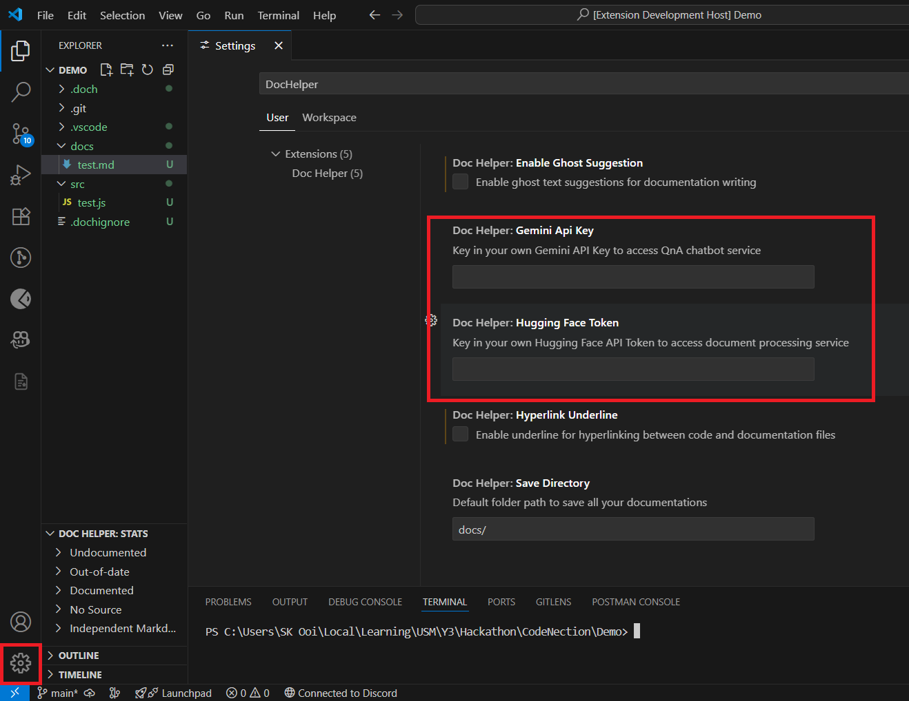

# Doc Helper (By Ne Zha Playing in Heaven)

This is a Visual Studio Code extension prototype to solve the CodeNection Hackathon's track 3 and problem statement 1, **"Fix the Docs: Smarter, Faster, Maintainable Documentation for the Real World by iFAST"**. It is a smart documentation assistant/tool that improves how technical documentation is created, consumed, and maintained in evolving software environments.

## Setup - Prerequisites

Before using our extension, you will need to download and install Node.js from [here](https://nodejs.org/en/download/).

After installing our extension from the Visual Studio Code Extension Marketplace, you will first need to setup your API key from Google Gemini and HuggingFace Token.

> Key in your Google Gemini API key (Get it from [here](https://aistudio.google.com/app/apikey))   Key in your Hugging Face Access Token (Get it from [here](https://huggingface.co/settings/tokens))

Then you will be ready to use our Doc Helper!

## What's in our extension?

You may refer to our documentation at [Phase 1](PROJECTDOC_PHASE1.md) then [Phase 2](PROJECTDOC_PHASE2.md).

## Known Issues

- Since we are using free Render to deploy our backend REST API, the backend server will sleep due to inactivity and requires a long time to boot up.

> To report any other issues, open command palette `[Ctrl+Shift+P]`, and type "Doc Helper: Report Issue", you will be guided to the GitHub report issue in Doc Helper repository.
